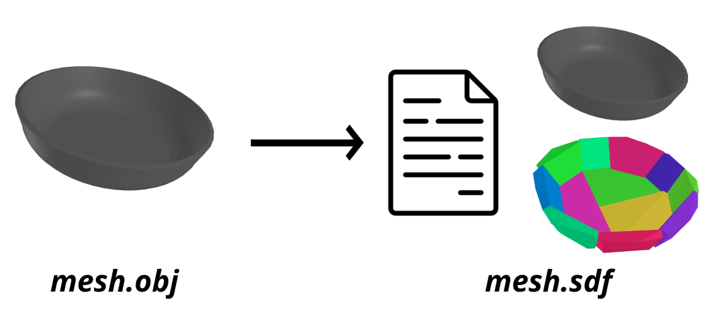

# Mesh-to-SDF converter



Given a (potentially nasty, nonconvex) mesh, automatically creates an [SDF](http://sdformat.org/) file that describes that object. The visual geometry is pointed to the input mesh, and the collision geometry is pointed to a convex decomposition of the input mesh (as performed by [trimesh](https://github.com/mikedh/trimesh/) and [vhacd](https://github.com/kmammou/v-hacd/).

This has been designed to interoperate well with [Drake](drake.mit.edu), but doesn't strictly need it.

# Dependencies

For just basic conversion:

```argparse lxml numpy trimesh```

and you need `testVHACD` on your `PATH`. I use [the procedure from this script](https://github.com/mikedh/trimesh/blob/main/docker/builds/vhacd.bash) to get it.

The visualization utility requires Drake.

# Usage
To perform the conversion (here, on an example mesh with a 1000x downscaling):

```
python generate_sdf_from_mesh.py test_data/bowl_6p25in.obj --scale 0.001 --preview
```

Use `--help` to see arguments; you can tune some VHACD parameters to influence the quality and complexity of the resulting decomposition. The defaults are tuned to create lightweight approximations of relative simple concave geometry; if you have more complex geometry, try increasing resolution, max # of hulls, and verts per hull.


If you have Drake installed, you can inspect the resulting SDF (use the menu at the right to show/hide the visual and collision mesh components):

```
python inspect_sdf_in_meshcat.py test_data/bowl_6p25in.sdf
```

Both can be invoked with `--help` to see additional arguments.
